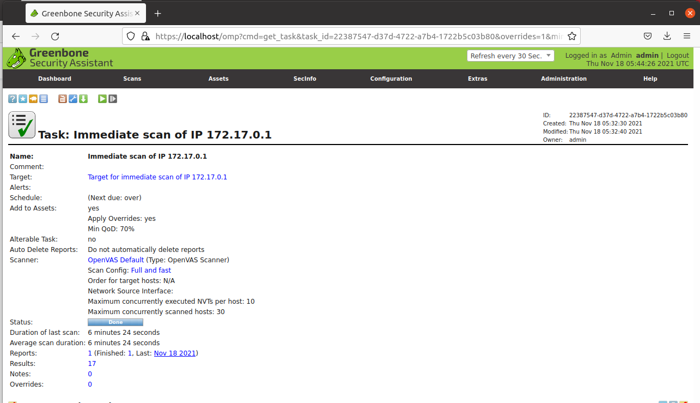
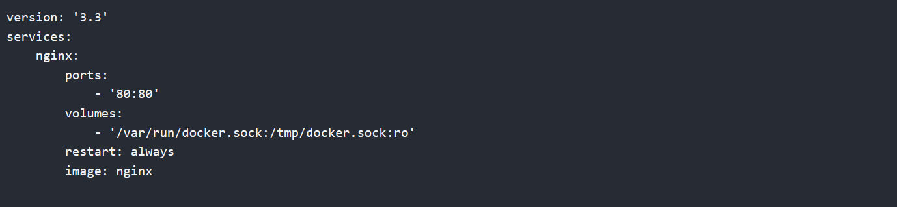

# Installing Docker with OpenVAS/Greenbone vulnerability scanner

## Setup

**Welcome to how to install Docker**

This is how to install Docker and OpenVAS vulnerability scanner. . 

Open your Ubuntu VM and open terminal.

**Apt Update**

Update all the reposititories.

<pre><code> sudo apt-get update</code></pre>

**Apt Upgrade**

Ugrade all the reposititories.

<pre><code> sudo apt-get upgrade</code></pre>

**Install Docker**

Install docker after update.

<pre><code> sudo apt-get install docker.io</code></pre>

**Check Status**

Check if docker is running

<pre><code> sudo service docker status</code></pre>

**If inactive, run this**

Run if not running.

<pre><code>sudo service docker start</code></pre>

**Install Container for OpenVAS**

Install container to run application

<pre><code>sudo docker run -d -p 443:443 --name openvas mikesplain/openvas</pre></code>

**Open Local Host**

Container is now local so open.

<pre><code>https://localhost/</pre></code>

**Login to OpenVAS**

Login to OpenVAS

<pre><code>login: admin password: admin</pre></code>

**Run Vulnerability Scan**

Open dashboard and hover over "Scans" and click "Task". Once it loads click the star icon and choose to create Vulnerability Scan.

**OUTPUT**
  

**How to create a docker-compose.yml file**
<pre><code>docker run -p 80:80 -v /var/run/docker.sock:/tmp/docker.sock:ro --restart always --log-out max-size=1g nginx</pre></code>

**OUTPUT**

